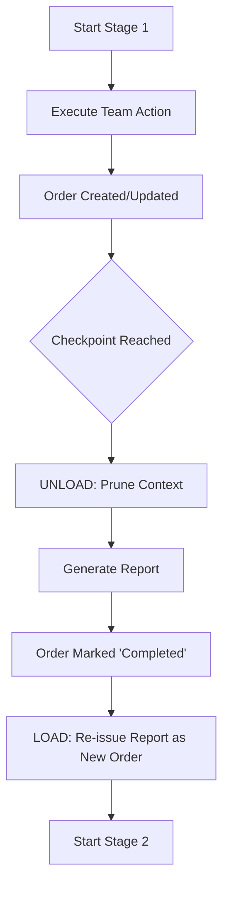

# Deep Dive: Flow as Conductor Logic (المسير)

In FlowLang, a `flow` is the **Conductor (المسير)**—not a simple list of instructions, but an active administrative engine that orchestrates the lifecycle of **Orders** across a professional workforce.

---

## 🏗 The Conductor's Architecture

The Conductor operates as a stateful orchestrator that manages the transition between **Stages**. Each stage is defined by a `checkpoint`.

### 1. The Unload/Load Cycle (تفريغ وتحميل)
This is the core mechanic for maintaining high fidelity and preventing AI hallucination. 

*   **Unload**: At the end of a checkpoint, the Conductor "dumps" the current working memory (`EvalContext`). It only preserves variables explicitly listed in the `report` clause.
*   **Complete**: Any `Order` in the report is marked as `completed`. Its history is sealed.
*   **Load**: The report data is then "loaded" as a fresh `Order` for the next stage. This ensures the next team member starts with a clean prompt, reducing noise from previous reasoning steps.

### 2. Sequential Distribution (التوزيع الدوري)
The Conductor ensures that professional work is distributed fairly and sequentially.
- When a flow moves from Stage A to Stage B, the team index for the next action is incremented.
- This creates a **Handover**: Member A produces the report, and Member B handles the next step.
- Implementation: Managed via `_select_team_member` which maintains a persistent `member_idx` counter per team.

---

## 🎼 Interaction with the Maestro (Process Trees)

The **Maestro (The Process Tree)** provides the hierarchical grounding for the Conductor.

| Component | Responsibility | Analogous To |
| :--- | :--- | :--- |
| **Flow (Conductor)** | Moving work through time/stages | The Factory Foreman |
| **Process (Maestro)** | Mapping work to the product structure | The Blueprint / Architect |
| **Chain (Guiding Thread)** | Maintaining causal links | The Production Line |

### Binary Path Grounding (0101)
To prevent "hallucination in space" (where the AI forgets where it is in a complex project), the Conductor injects the **Binary Path** into every action.
- Every node in the Maestro tree has a path like `0101` (denoting branches taken from the root).
- The AI Provider receives this path in the system prompt.
- Result: The AI is "spiritually anchored" in the hierarchy, knowing exactly which component it is building relative to the whole.

---

## 🧪 Principle of Maximal Granularity (المعايرة القصوى)

**"Maximal Checkpoints = Minimal Hallucinations"**

Developers are encouraged to define checkpoints for *every* significant transition.
1.  **Context Hygiene**: Frequent pruning keeps the prompt size small and the information density high.
2.  **Audit Stability**: Each checkpoint creates a permanent record in the `Order` audit trail.
3.  **Causal Hits**: Every checkpoint touch updates the **Data Chain**, allowing for "Exclusive Activity" logic to skip redundant work if an upstream stage has already satisfied a requirement.

---

## 🛠 Implementation Reference

- **`Runtime._execute_flow`**: Merges internal staging with the Lark parse tree.
- **`EvalContext.prune`**: The garbage collector for "Context Noise."
- **`Order.audit_trail`**: The immutable diary of the Conductor's movements.
